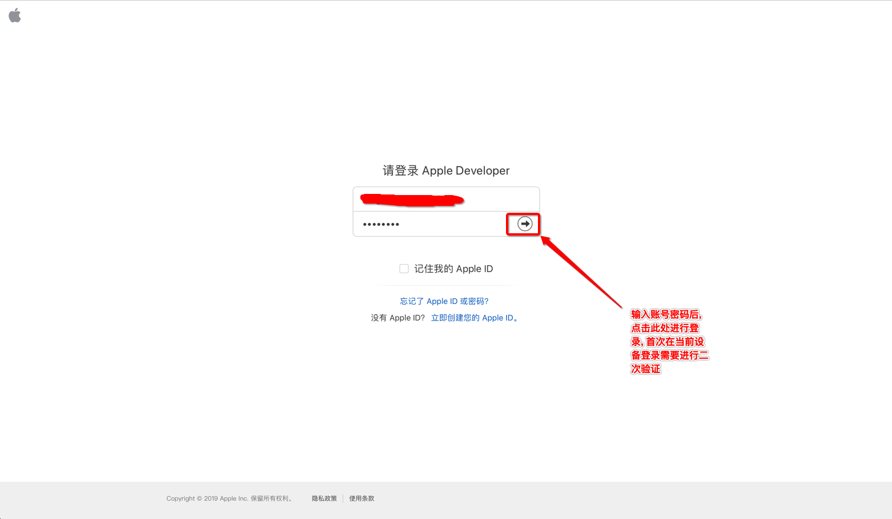
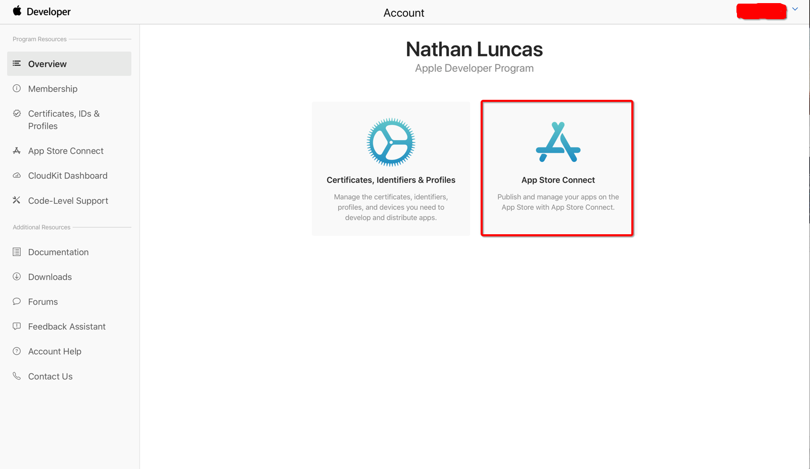
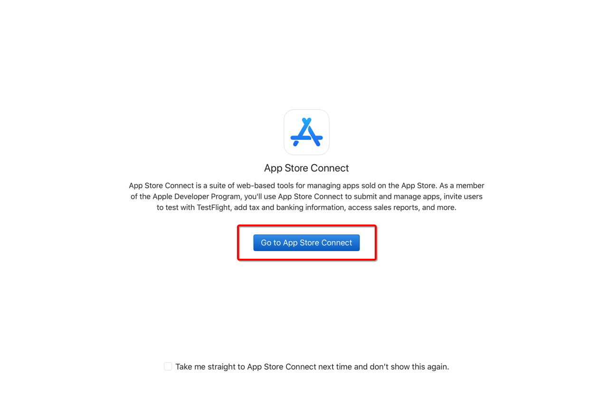
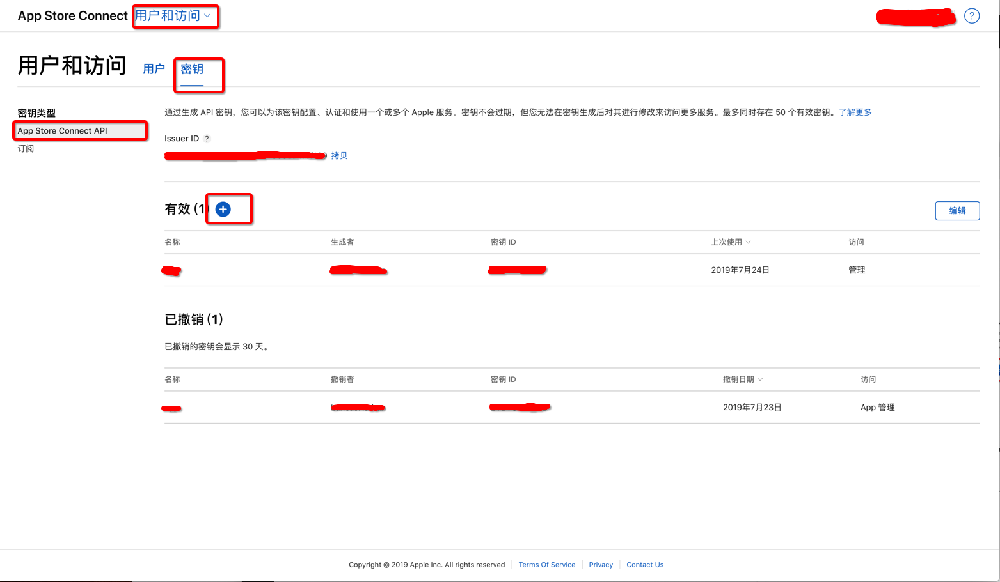
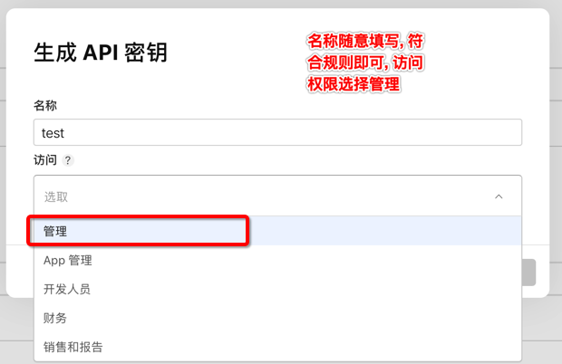
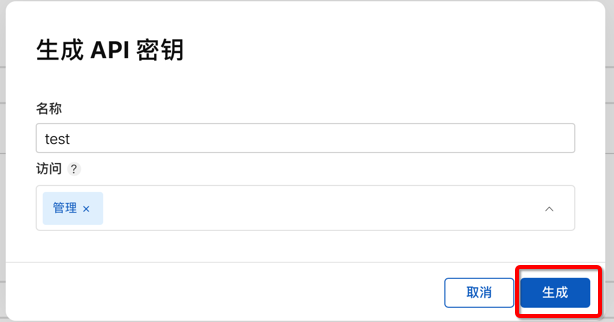

# Auto Signature

## 服务器
- 将[ausign文件夹](./ausign)上传至服务器最外层路径并将其修改为全局路径

- 按照[命令行签名使用教程.txt](./ausign/命令行签名使用教程.txt)中所示,先行在服务器进行注册 `ausign -email xxxxx@qq.com -p 123456`, 注册成功后出现成功提示

- 将[ausign.sh](./ausign.sh)脚本上传至服务器/root路径下, 并赋予执行权限`chmod +x ausign.sh`

- 将`jar`包提交至服务器`/root`目录下, 启动即可`nohup java -jar signature-0.0.1-SNAPSHOT.jar &`

## 创建账号
- 登录[Apple Developer](https://developer.apple.com)

- 创建授权令牌

- 下载`API密钥`, 复制`Issuer ID、密钥 ID`

- 添加至后台, 使其可用

- 导出的p12文件密码需要与[ausign.sh](./ausign.sh)中密码一致

- 其余配置请在[Config.java](./signature/src/main/java/online/iizvv/core/config/Config.java)中修改

- [使用签名的.mobileconfig文件进行无线iPhone设置](http://www.rootmanager.com/iphone-ota-configuration/iphone-ota-setup-with-signed-mobileconfig.html)
